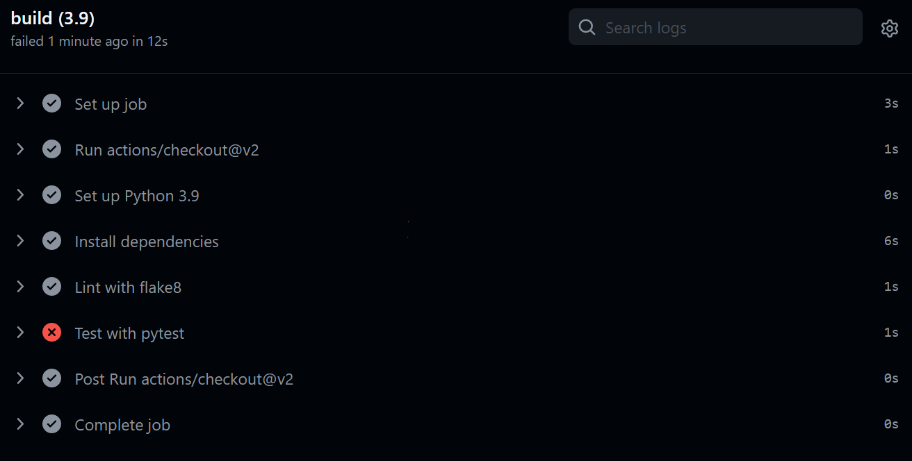
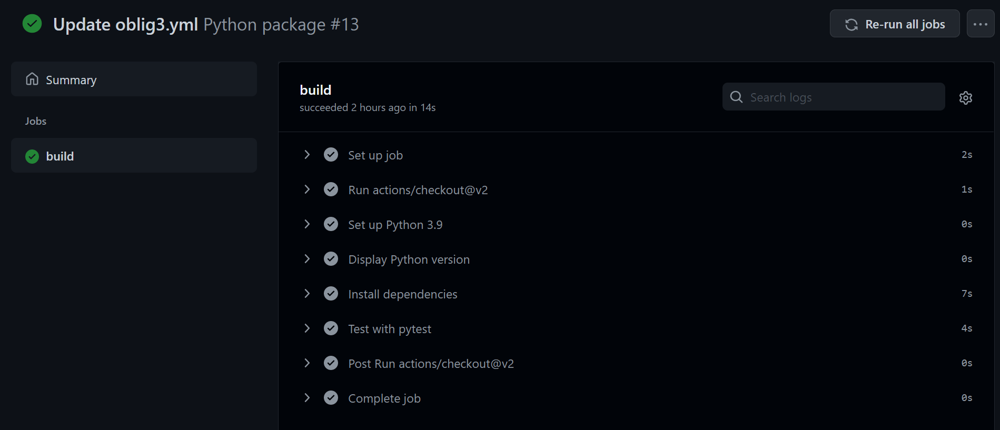
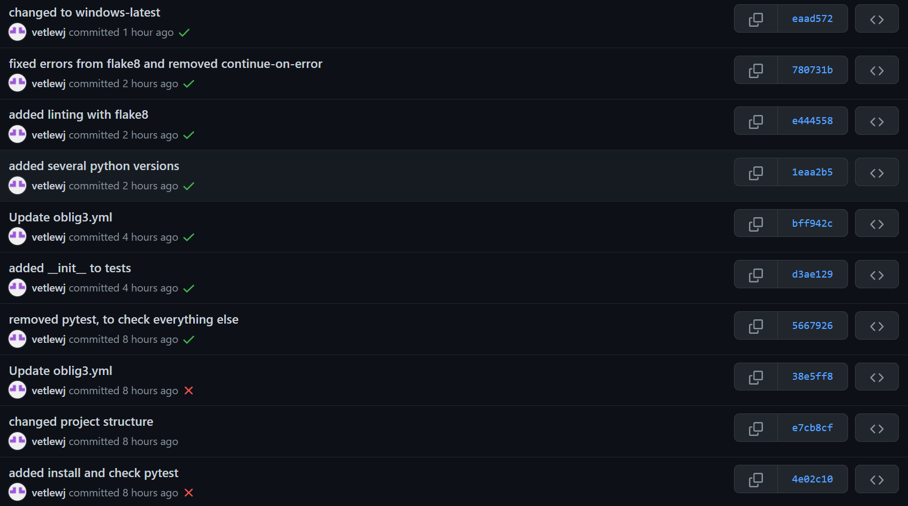

# SE_and_Testing_oblig3

## Setting up

I started by looking through the documentation of GitHub Actions on [Learn GitHub Actions](https://docs.github.com/en/actions/learn-github-actions) and [Building and testing Python](https://docs.github.com/en/actions/automating-builds-and-tests/building-and-testing-python). On [Building and testing Python](https://docs.github.com/en/actions/automating-builds-and-tests/building-and-testing-python) there is a template to help you get started with the Python workflow template. I copied this code into [.github/workflows/oblig3.yml](.github\workflows\oblig3.yml) and committed and pushed. This automatically tries to set up the project and run the tests in tests folder. This is a snippet of what happened:

## successful test

The error was that it could not find the import statement in the test.After a while of trying to find out what the error was and editing the yml file, I found out that I hadn't created a \_\_init\_\_ file in the tests folder. After creating that and the pushing, it worked fine and Github Actions automatically tested the tests in Oblig2_Testing/tests folder. This was how it looked:

This was the first real test that passed. After this I added tests for several versions of Python. I also added linting with flake8 and tried to package workflow data as artifacts.

## Checking commits

Every time a commit is pushed to GitHub, GitHub Actions checks if there is any errors. Below is a snippet of both successful and unsuccesful commits. A green checkamrk means successful, red cross means unseccsful and no symbol means it didnt run.

## What GitHub Actions does

Every time a commit is pushed to GitHub, it runs the jobs that is listed.

### What I set up in the workflow

I followed the guide on [GitHub](https://docs.github.com/en/actions/automating-builds-and-tests/building-and-testing-python) to set up GitHub Actions, I tried setting up workflow data packaging, but I couldn't make it work so it is commented out.

- I have set the working directory as Oblig2_Testing because that is where the code from Oblig 2 is.

- I set it to run on ubuntu-latest because running it on windows-latest took twice as long the ubuntu.

- It runs all the tests in the python versions listed in the matrix python-version. It sets up all of these and the prints the version.

- Installs and/or upgrades pip to the latest version, and then installs dependencies from requirements.txt

- Uses Flake8 to lint code and raises an error if the code does not follow pep8.

- Runs tests in tests folder with pytest
